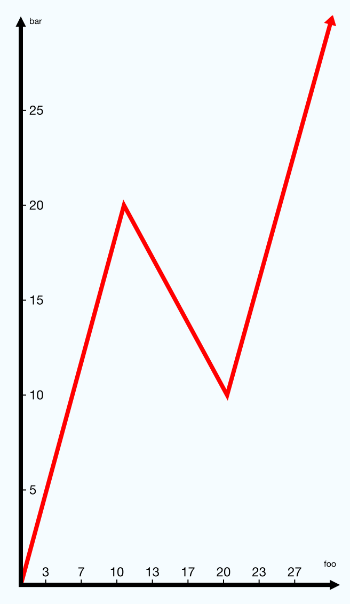

###React Native Line Plot

####Installation

The only dependency for this package is React Native SVG. Installation
instructions for SVG can be found at
https://github.com/magicismight/react-native-svg/blob/master/README.md
or below:

First ensure that rnpm is installed:
```
npm i rnpm -g
```
Then install React Native SVG:
```
npm install react-native-svg --save
```
Link it to rnpm:
```
rnpm link react-native-svg
```

After installing SVG, just install the library from npm:
```
npm i react-native-line-plot
```

####Basic Usage

Import the library in your index.ios.js file:
```
import Graph from 'react-native-line-plot';
```

Then, stick the Graph component in a render function:
```
var GraphTestProject = React.createClass({
    render () {
        <View style={styles.container}>
            <Graph
                data={[[0,0], [33, 30], [66,25], [99,50]]}
                graphColorPrimary='#000000'
                graphColorSecondary='#FF0000'
                xUnit='foo'
                yUnit='bar'
            />
        </View>    
    }
});
```

You should get something like this:


####Props
Name                | Type   | Required? | Description
--------------------|--------|-----------|--------------
data                | Array  |  Yes      | An array of coordinate pairs in the form [x,y].
graphColorPrimary   | String |  Yes      | The color of the coordinate axes.
graphColorSecondary | String |  Yes      | The color of the line being plotted.
graphWidthPrimary   | String |           | The thickness of the coordinate axes.
graphWidthSecondary | String |           | The thickness of the line being plotted.
graphHeight         | Number |           | Height of the graph. Defaults to a little less than the screen height.
graphWidth          | Number |           | Width of the graph. Default to a little less than the screen width.
paddingBottom       | Number |           | Space underneath the graph.
xAxisDensity        | Number |           | Number of tick-marks on the x-Axis plus 1.
yAxisDensity        | Number |           | Number of tick-marks on the y-Axis plus 1.
xUnit               | String |           | Unit for x-Axis values.
yUnit               | String |           | Unit for y-Axis values.

####Date Mode
The Graph component has special behaviors when xUnit is set to "date". If this
is the case, the x values of the data prop will be treated as Unix time values
given in milliseconds, and the graph will display these values as dates instead
of numbers. An example is displayed below with xAxisDensity set to 4.


